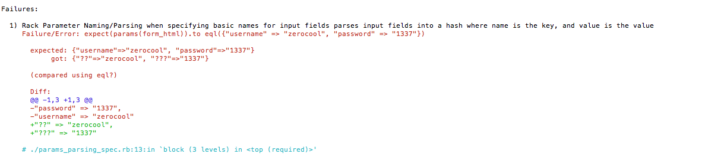
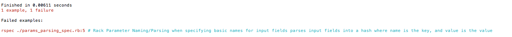

#First Look at Rspec

Oh god, it's a giant wall of text. 

```
Rack Parameter Naming/Parsing
  when specifying basic names for input fields
F    parses input fields into a hash where name is the key, and value is the value (FAILED - 1)


Failures:

  1) Rack Parameter Naming/Parsing when specifying basic names for input fields parses input fields into a hash where name is the key, and value is the value
     Failure/Error: expect(params(form_html)).to eql({"username" => "zerocool", "password" => "1337"})
       
       expected: {"username"=>"zerocool", "password"=>"1337"}
            got: {"??"=>"zerocool", "???"=>"1337"}
       
       (compared using eql?)
       
       Diff:
       @@ -1,3 +1,3 @@
       -"password" => "1337",
       -"username" => "zerocool"
       +"??" => "zerocool",
       +"???" => "1337"
       
     # ./params_parsing_spec.rb:13:in `block (3 levels) in <top (required)>'

Failures:

  1) Rack Parameter Naming/Parsing when specifying basic names for input fields parses input fields into a hash where name is the key, and value is the value
     Failure/Error: expect(params(form_html)).to eql({"username" => "zerocool", "password" => "1337"})
       
       expected: {"username"=>"zerocool", "password"=>"1337"}
            got: {"??"=>"zerocool", "???"=>"1337"}
       
       (compared using eql?)
       
       Diff:
       @@ -1,3 +1,3 @@
       -"password" => "1337",
       -"username" => "zerocool"
       +"??" => "zerocool",
       +"???" => "1337"
       
     # ./params_parsing_spec.rb:13:in `block (3 levels) in <top (required)>'

Finished in 0.00892 seconds
1 example, 1 failure

Failed examples:

rspec ./params_parsing_spec.rb:5 # Rack Parameter Naming/Parsing when specifying basic names for input fields parses input fields into a hash where name is the key, and value is the value

Finished in 0.00892 seconds
1 example, 1 failure

Failed examples:

rspec ./params_parsing_spec.rb:5 # Rack Parameter Naming/Parsing when specifying basic names for input fields parses input fields into a hash where name is the key, and value is the value
```

Ok.  Time to break this down and read it section by section.  Fortunately, it's syntax-higlighted. 

#Test Description


Whew.  Even taking only the first section, this is still intimidating.  I need to read this word by word. 

  1) _Rack Parameter Naming/Parsing_ when specifying _basic names_ for _input fields_ _parses_ _input fields_ into a _hash_ where _name_ is the _key_, and _value_ is the _value_

Ok. I've separated out all of the lines and highlighted them.  This is still an intimidating file. 

My brain understands something when it has a visual analogy for it.  My brain does not have a visual analogy for any of those things yet. 

#Details of test failure 



Ahh! Another wall of text.  Oh god.

Time to read it line by line. 

```
 1) Rack Parameter Naming/Parsing when specifying basic names for input fields parses input fields into a hash where name is the key, and value is the value
```

This is a repetition of the first line. Still intimidating, getting less so with exposure. 


```
  Failure/Error: expect(params(form_html)).to eql({"username" => "zerocool", "password" => "1337"})
```

Ok.  This is actually more readable than the line above it. (but I expect it to be very intimidating to a newbie who does not already know ruby.)

If I had to take a guess, I would say, that this meant, 

"I expected that there is a gumball machine called params.  The 'quarter' it takes in is an html form.  It gives me back a gumball that looks like {"username" => "zerocool", "password" => "1337"}.  When I put in a quarter, I did not get back the gumball I expeted. 

(See my function is like a gumball machine analogy).

```
  expected: {"username"=>"zerocool", "password"=>"1337"}
            got: {"??"=>"zerocool", "???"=>"1337"}
       
       (compared using eql?)
``` 

This is actually useful.  It says that, from the gumball machine, they were expecting a thing that looked like 

```
{"username"=>"zerocool", "password"=>"1337"}
```

and they got a thing that looked like

```
  {"??"=>"zerocool", "???"=>"1337"} 
```

So basially it looks like we got the wrong gumball back from the params gumball machine.


```
 (compared using eql?)
```

This seems like this is supposed to compare the two gumballs and seeing if they are exactly equal.


```
  Diff:
       @@ -1,3 +1,3 @@
       -"password" => "1337",
       -"username" => "zerocool"
       +"??" => "zerocool",
       +"???" => "1337"
```

This diff sectio is the most confusing.  There are a lot of puzzling symbols that I don't quite know the meaning off.  With a sectio this small, though, it's not hard to hypothesize that the top bit is showing what was expected and the bottom bit is showing what was actually there. 

```
  # ./params_parsing_spec.rb:13:in `block (3 levels) in <top (required)>'
```
This is actually where you see the filename and line number to concentrate on.  However, the _block (3 levels) in <top (required)>_ is very confusing. 




This seems straightforward and repeat of the first line. It tells us

```
  Finished in 0.00892 seconds
  1 example, 1 failure 
```

How long it took to run the rspec thingy. I think the technical term is spec. Or maybe testing suite.
That there was...one example? I assume that is a test? Whatever 'example' means, there's one of them and just one failure. 

```
  rspec ./params_parsing_spec.rb:5 # Rack Parameter Naming/Parsing when specifying basic names for input fields parses input fields into a hash where name is the key, and value is the value
```

This tells us a line nubmer and a file naem again.  Strange.  The previous one said line 13. this one says line 5.  I wonder what the difference is?
